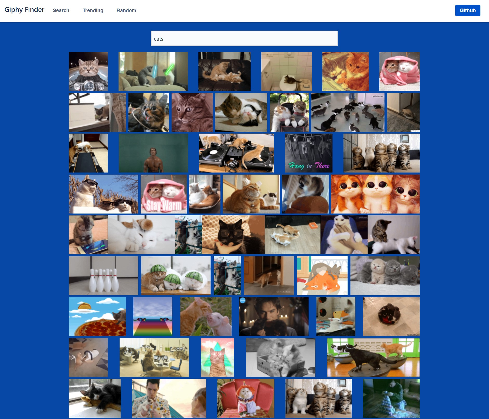
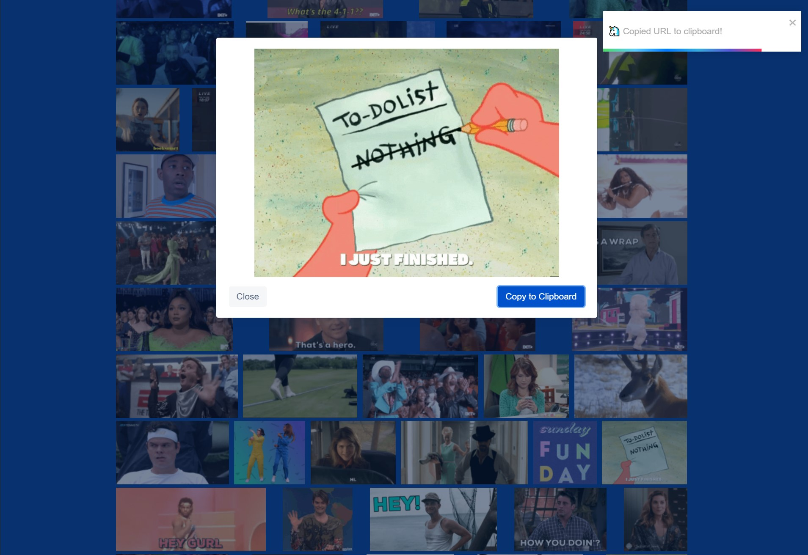

# Giphy Finder

Simple gif searcher, Uses redux sagas to fetch giphy API results and handle the async state updates or error handling. Stores the results in redux state to enable infinite scrolling/pagination, as well as a lightbox full gif view.

 [Live website](https://gifs.spdevuk.com)

tools used:
- [React](https://github.com/facebook/react)
- [Redux](https://github.com/reduxjs/redux), [Redux Saga](https://github.com/redux-saga/redux-saga)
- [Connected React Router](https://github.com/supasate/connected-react-router)
- [Axios](https://github.com/axios/axios)
- Lots of emojis 🥴


[](https://app.netlify.com/sites/giphy-finder/deploys)
___






___

# Development

Using the giphy API requires an API key.
- [Visit the giphy site](https://developers.giphy.com/) and sign up, request an API key.
- Create a file in the root of the project named `.env` and add the API key like so:

```
REACT_APP_API_KEY=<api key goes here>
```


`yarn install` to install deps.

`yarn start` to run the dev server.
___

# Deployment

- Link the github repo to netlify, add the `REACT_APP_API_KEY` as an env variable.
- Make sure the build command is `yarn build`.
- Change the `site name` to whatever URL you want, or set up a custom domain.
- Any time changes are made it will rebuild and be redeployed.